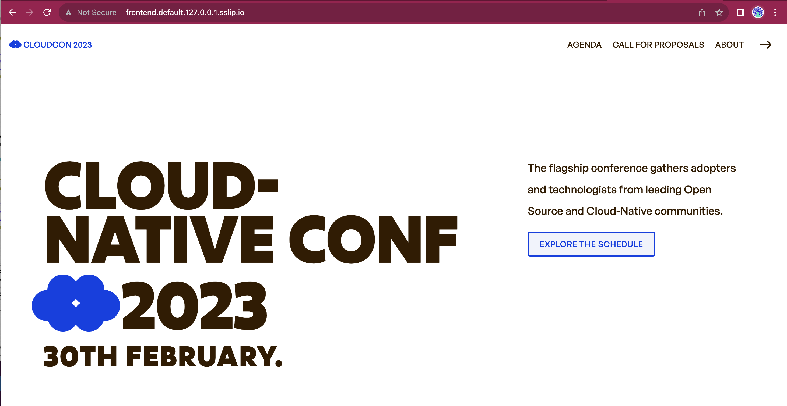
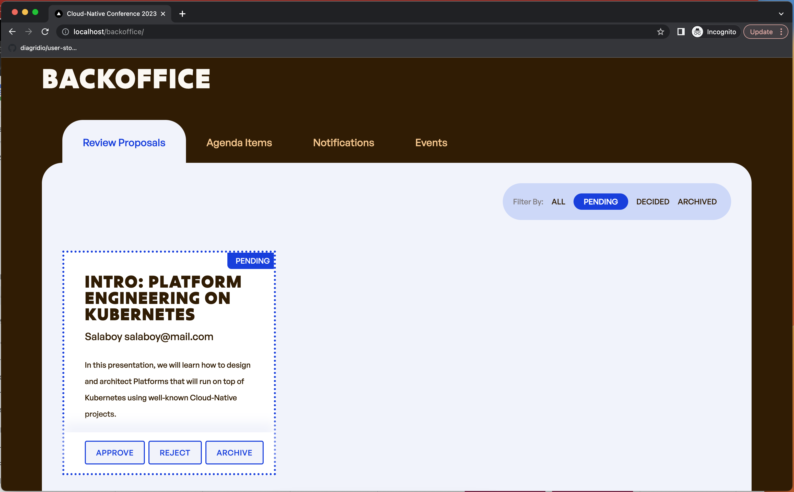
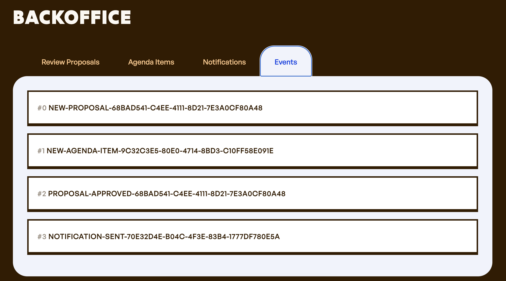

# Capítulo 1 :: (A ascensão das) Plataformas Baseadas em Kubernetes

---
_🌍 Disponível em_: [English](README.md) | [中文 (Chinese)](README-zh.md) | [Português (Portuguese)](README-pt.md)

> **Nota:** Trago a você pela fantástica comunidade cloud-native e seus [ 🌟 contribuidores](https://github.com/salaboy/platforms-on-k8s/graphs/contributors)!
---

## Cenário da Conference Application

A aplicação que vamos modificar e utilizar ao longo dos capítulos do livro é um simples "esqueleto funcional", o que significa que ela é complexa o suficiente para nos permitir testar suposições, ferramentas e frameworks. No entanto, ela não é o produto final que nossos clientes usarão.

A "Conference Application" representa um caso de uso bem simples, e permite que potenciais _palestrantes_ enviem propostas que os _organizadores_ da conferência avaliarão. Veja abaixo a página inicial da aplicação:

Veja como a aplicação é comumente usada:

1. **C4P:** Potenciais _palestrantes_ podem enviar uma nova proposta indo à seção **Chamada para Propostas** (C4P) da aplicação.
   
2. **Revisão & Aprovação**: Uma vez que uma proposta é enviada, os _organizadores_ da conferência podem revisar (aprovar ou rejeitar) usando a seção **Backoffice** da aplicação.
   
3. **Anúncio**: Se aceita pelos _organizadores_, a proposta é automaticamente publicada na página **Agenda** da conferência.
   
4. **Notificação do Palestrante**: No **Backoffice**, um _palestrante_ pode verificar a aba **Notifications**. Lá, potenciais _palestrantes_ podem encontrar todas as notificações (e-mails) enviadas a eles. Um palestrante verá e-mails de aprovação e rejeição nesta aba.
   

### Uma aplicação orientada a eventos

**Cada ação na aplicação resulta em novos eventos sendo emitidos.** Por exemplo, é esperado que eventos sejam emitidos quando:
-  uma nova proposta é enviada;
-  a proposta é aceita ou rejeitada;
-  notificações são enviadas.

Esses eventos são enviados e depois capturados por uma aplicação frontend. Felizmente, você, o leitor, pode ver esses detalhes na aplicação acessando a aba **Events** na seção **Backoffice**.

## Resumo e Contribuição

Quer melhorar este tutorial? Abra uma [issue](https://github.com/salaboy/platforms-on-k8s/issues/new), mande-me uma mensagem no [Twitter](https://twitter.com/salaboy), ou envie um [Pull Request](https://github.com/salaboy/platforms-on-k8s/compare).
